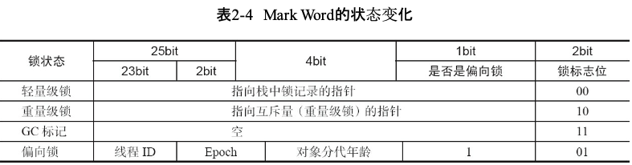
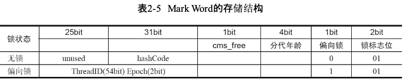

# 并发编程01

​	因公司项目需要，目前在快速阅读学习由方腾飞作，机械工业出版社出版的《java并发编程艺术》，希望提炼精简相关知识点和个人思考总结，希望在7天内完成一个版本，系列文章以并发编程(01-07)的结构发篇处理，如出现理解偏差，欢迎评论指正；

## 术语描述

阅读前提假设java、线程相关概念理论、代码已熟悉；


## 使用并发会遇到的问题、并发的底层原理与实现

### 使用并发会遇到的问题

#### 上下文切换

​	多线程的执行，实质为CPU为每个线程分配时间片执行各自任务，时间片的分配有指定的算法实现，时间片一般为几十毫秒ms；

​	时间片的切换过程：切换前保存上一个任务的状态，切换线程，切换回原任务时加载之前保存的状态。任务的保存到再加载的过程为一次上下文切换；

​	并发中线程存在线程创建和上下文切换开销，对于这种情况我们需要量化监控:

​		·使用Lmbench3测量上下文切换的时长；

​		·使用vmstat测量上下文切换次数；

##### 如何减少上下文切换

​	减少上下文切换的方法有无锁并发变成、CAS算法、使用最少线程和使用协程；

​	无锁并发编程：多线程竞争锁时，会引起上下文切换，故多线程时可想办法避免使用锁，如将数据的ID按照Hash算法取模分段，不同线程处理不同段的数据；

​	CAS算法：java的Atomic包使用CAS算法更新数据，且不需要加锁；

​	使用最少线程：避免创建不需要的线程，比如任务少缺创建很多线程会造成大量线程都处于等待状态；

​	协程：单线程里实现多任务调度，并在单线程里维持多个任务间的切换 ；

##### 减少上下文切换实战

###### 通过减少线上大量waiting线程，减少上下文切换次数

​	1.jstack查看线程pid进程里线程工作情况；

​		sudo -u admin /opt/ifeve/java/bin/jstack 31177 > /home/dump17

​	2.统计所有线程分别处于何状态，查看多少线程处于waiting(onobjectmonitor)状态；

```
grep java.lang.Thread.State dump17 | awk '{print $2$3$4$5}'
           | sort | uniq -c
    39 RUNNABLE
    21 TIMED_WAITING(onobjectmonitor)
    6 TIMED_WAITING(parking)
    51 TIMED_WAITING(sleeping)
    **305 WAITING(onobjectmonitor)**
    3 WAITING(parking)
```

​	3.进入dump文件查处于WAITING(onobjectmonitor)线程在处理什么，发现大多数为jboss工作线程在await，说明jboss线程池里线程收到任务少，大量线程都闲着；

```
"http-0.0.0.0-7001-97" daemon prio=10 tid=0x000000004f6a8000 nid=0x555e in
       Object.wait() [0x0000000052423000]
    java.lang.Thread.State: WAITING (on object monitor)
    at java.lang.Object.wait(Native Method)
    - waiting on <0x00000007969b2280> (a org.apache.tomcat.util.net.AprEndpoint$Worker)
    at java.lang.Object.wait(Object.java:485)
    at org.apache.tomcat.util.net.AprEndpoint$Worker.await(AprEndpoint.java:1464)
    - locked <0x00000007969b2280> (a org.apache.tomcat.util.net.AprEndpoint$Worker)
    at org.apache.tomcat.util.net.AprEndpoint$Worker.run(AprEndpoint.java:1489)
    at java.lang.Thread.run(Thread.java:662)
```

​	4.减少jboss工作线程，找到jboss的线程池配置，将maxThreads降到100；

```
<maxThreads="250" maxHttpHeaderSize="8192"
    emptySessionPath="false" minSpareThreads="40" maxSpareThreads="75"
        maxPostSize="512000" protocol="HTTP/1.1"
    enableLookups="false" redirectPort="8443" acceptCount="200" bufferSize="16384"
    connectionTimeout="15000" disableUploadTimeout="false" useBodyEncodingForURI= "true">
```

​	5.重启jboss，再dump线程信息，后统计WAITING(onojbectmonitor)线程，发现减少了175个。WAITING线程少了，系统上下文切换次数就会少，原因是每一次从WAITING到RUNNABLE都会进行一次上下文切换，可使用vmstat命令测试；

```
grep java.lang.Thread.State dump17 | awk '{print $2$3$4$5}'
       | sort | uniq -c
      44 RUNNABLE
      22 TIMED_WAITING(onobjectmonitor)
      9 TIMED_WAITING(parking)
      36 TIMED_WAITING(sleeping)
      **130 WAITING(onobjectmonitor)**
   1  WAITING(parking)
```

#### 死锁

​	避免死锁的常见方法：

​		·避免一个线程同时获取多个锁；

​		·避免一个线程在锁内同时占多个资源，尽量保证每个锁只占用一个资源；

​		·尝试使用定时锁，使用lock.tryLock(timeout)替代使用内部锁机制；

​		·对于数据库锁，加锁和解锁必须在一个数据库连接里，否则解锁失败；

#### 资源限制的挑战

	##### 资源限制

​	资源限制是进行并发编程时，程序的执行速度受限于计算机硬或软件资源；

​	硬件资源限制：

​		宽带的上传/下载速度、硬盘读写速度、cpu处理速度；

​	软件资源限制:

​		数据库连接数、socket连接数等；

##### 资源限制引发的问题

​	并发编程中将代码执行速度加快的原则为将代码中串行执行的部分变成并发执行，此时该部分处理会受限于资源，仍并行执行由于增加了上下文切换和资源调度的时间，会反而让程序变慢；

##### 如何解决资源限制问题

​	对于硬件资源限制，考虑用集群并行执行，如odps、hadoop搭建服务器集群，不同机器处理不同数据，以数据id%机器数，计算得到一个机器编号，后由对应编号的机器处理该笔数据；

​	对于软件资源限制，可考虑使用资源池将资源复用，如使用连接池将数据库和socket连接复用，或者在调用对方webservice接口获取数据时，只建立一个连接；

##### 在资源限制情况下进行并发编程

​	如何在资源限制情况下，让程序更快？方法为根据不同的资源限制调整程序的并发度，如下载文件依赖带宽、硬盘读写速度。有数据库操作时，涉及数据库连接数，如sql执行非常快，而线程的数量比数据库连接数大很多，则某些线程会被阻塞，等待数据库连接。


## java并发机制的底层实现原理

### volatile的应用

​	volatile是轻量级synchronized，在多处理器开发中保证共享变量的可见性；

​	可见性可以理解为当一个线程修改一个共享变量时，另一个线程能读到这个修改的值。若volatile恰当使用时，会比synchronized的使用和执行成本低，因其不会引起线程的上下文切换和调度。接下来将从硬件层面上intel处理器如何实现volatile入手深入分析，以便我们可以正常使用volatile变量；

#### volatile的定义与实现原理

​	java语言规范第三版中定义为：java允许线程访问共享变量，为确保共享变量能被准确和一致更新，线程应该确保通过***排他锁***__***单独***_获得这个变量；

​	在某些情况下，volatile比锁更加方便，一个字段被声明为volatile，java线程内存模型确保所有线程看到这个变量的值上一致的；

与volatile实现原理相关cpu术语说明:

内存屏障：memory barries，用于实现对内存操作的顺序限制的一组处理器指令；

缓冲行：cache line，缓存中可分配的最小存储单位。处理器填写缓存线时会加载整个缓存线，需要使用多个主内存读周期（关于缓存行部分，比较复杂且涉及的问题点较多，会另起一篇文章来描述）；

原子操作：atomic operations，不可中断的一个或一系列操作；

缓存行填充：cache fill fill，当处理器识别到从内存中读取操作数是可缓存的，处理器读取整个缓存行到适当的缓存（L1（一级缓存）,L2（二级缓存）,L3（三级缓存）的或所有)；

缓存命中:cache hit，当处理器将操作数写回到一个内存缓存的区域时，首先检查这个缓存的内存地址是否在缓存行中，若存在一个有效的缓存行，则处理器将此操作数写回到缓存，而不是写回到内存，这个操作叫写命中；

写缺失：write misses the cache，一个有效的缓存行被写入到不存在的内存区域；

##### volatile如何保证可见性

volatile instance = new Singleton();//instance为volatile变量

对应汇编为：

0x01a3de1d: movb $0×0,0×1104800(%esi);0x01a3de24: lock addl $0×0,(%esp);

经查IA-32架构软件开发者手册，lock指令在多核处理器下作用{*这两件事情在IA-32软件开发者架构手册的第三册的多处理器管理章节（第8章）中有详细阐述*}：

1.将当前处理器缓存行的数据写回到系统内存；

2.此写回内存的操作会使在其他CPU里缓存了该内存地址的数据无效；

  为提高处理速度，处理器不直接和内存通信，而是先将系统内存的数据读取内部缓存(L1,L2或其他)后再操作，操作完后不知何时会写到内存。若对声明了volatile的变量进行写操作，JVM向处理器发送一条lock前缀指令，将该变量所在缓存行的数据写回到系统内存。写会内存时如果其他处理器缓存的值还是旧的，在执行计算操作会有问题，因此多处理器下，为保证各个处理的缓存一致，就会实现缓存一致性协议，每个处理器通过嗅探在总线上传播的数据来检测自己缓存的值是不是过期了，当处理器发现自己的缓存行对应的内存地址被修改，就将当前处理器的缓存行设置为无效状态，当处理器对这个数据进行修改操作时，会重新从系统内存中把数据读到处理器缓存里。

##### volatile的实现原则

​	1）lock前缀指令会引起处理器缓存回写到内存；

​			lock前缀指令导致在执行指令期间，声言处理器的lock信号，多处理器环境中，lock信号确保在声言该信号期间，处理器可以独占任何共享内存*{因为它会锁住总线，导致其他CPU不能访问总线，不能访问总线就意味着不能访问系统内存}*。但是在最近的处理器中，lock信号一般不锁总线，而是锁缓存(锁总线开销大)。对于Intel486和Pentium处理器,锁操作时总是在总线上声言lock信号。但P6和目前处理器中,若访问的内存区域已缓存在处理期内部,则不会声言lock信号。而是锁定这块内存区域的缓存并回写到内存，并使用缓存一致性极致确保修改的原子性，此操作为"缓存锁定"，缓存一致性机制会阻止同时修改由两个以上处理器缓存的内存区域数据。

​	 2）一个处理器的缓存回写到内存会导致其他处理的缓存无效；

​			IA32处理器和Intel64使用MESI（修改、独占、共享、无效）控制协议去维护内部缓存和其他处理器缓存一致性。

​			例如，在Pentium和P6 family处理器中，如果通过嗅探一个处理器来检测其他处理器打算写内存地址，而这个地址当前处于共享状态，那么正在嗅探的处理器将使它的缓存行无效，在下次访问相同内存地址时，强制执行缓存行填充。

#### volatile的使用优化

著名的Java并发编程大师Doug lea在JDK 7的并发包里新增一个队列集合类Linked-TransferQueue，它在使用volatile变量时，用一种追加字节的方式来优化队列出队和入队的性能，LinkedTransferQueue的代码如下：

```java
private transient f?inal PaddedAtomicReference<QNode> head; 
private transient f?inal PaddedAtomicReference<QNode> tail; 
static f?inal class PaddedAtomicReference <T> extends AtomicReference T> { 
// 使用很多4个字节的引用追加到64个字节 
Object p0, p1, p2, p3, p4, p5, p6, p7, p8, p9, pa, pb, pc, pd, pe; 
PaddedAtomicReference(T r) { 
super(r); 
} 
}
public class AtomicReference <V> implements java.io.Serializable { 
private volatile V value; 
// 省略其他代码 
｝
```

##### 追加字节能优化性能?

​	看LinkedTransferQueue这个类，它使用一个内部类类型来定义队列的头节点（head）和尾节点（tail），而这个内部类PaddedAtomicReference相对于父类AtomicReference只做了一件事情，就是将共享变量追加到64字节。我们可以来计算下，一个对象的引用占4个字节，它追加了15个变量（共占60个字节），再加上父类的value变量，一共64个字节；

##### 为什么追加64字节能够提高并发编程的效率呢

​	因为对于英特尔酷睿i7、酷睿、Atom和NetBurst，以及Core Solo和Pentium M处理器的L1、L2或L3缓存的高速缓存行是64个字节宽，不支持部分填充缓存行，这意味着，如果队列的头节点和尾节点都不足64字节的话，处理器会将它们都读到同一个高速缓存行中，在多处理器下每个处理器都会缓存同样的头、尾节点，当一个处理器试图修改头节点时，会将整个缓存行锁定，那么在缓存一致性机制的作用下，会导致其他处理器不能访问自己高速缓存中的尾节点，而队列的入队和出队操作则需要不停修改头节点和尾节点，所以在多处理器的情况下将会严重影响到队列的入队和出队效率。Doug lea使用追加到64字节的方式来填满高速缓冲区的缓存行，避免头节点和尾节点加载到同一个缓存行，使头、尾节点在修改时不会互相锁定；

##### 那么是不是在使用volatile变量时都应该追加到64字节呢?

*(不过这种追加字节的方式在Java 7下可能不生效，因为Java 7变得更加智慧，它会淘汰或重新排列无用字段，需要使用其他追加字节的方式)*

​	不是，在两种场景下不应该使用这种方式:

​	1.***缓存行非64字节宽的处理器***。如P6系列和奔腾处理器，它们的L1和L2高速缓存行是32个字节宽；

​	2.***共享变量不会被频繁地写***。因为使用追加字节的方式需要处理器读取更多的字节到高速缓冲区，这本身就会带来一定的性能消耗，如果共享变量不被频繁写的话，锁的几率也非常小，就没必要通过追加字节的方式来避免相互锁定；

### synchronized的实现远离与应用

  synchronized为重量级锁，在javaSE1.6进行了优化，为了减少获得锁和释放锁带来的性能消耗引入了偏向锁和轻量级锁，以及所得存储结构和升级过程，已并不很重量级。

#### synchronized实现同步的基础：java的每一个对象都可以作为锁。

​	·对于普通同步方法，琐是当前实例对象；

​	·对于静态同步方法，琐是当前类的Class对象；

​	·对于同步方法块，锁是synchronized括号里配置的对象；

#### 锁到底存在哪里？锁里面会存储什么信息呢？ 

当一个线程试图访问同步代码块时，它首先必须得到锁，退出或抛出异常时必须释放锁；

JVM基于进入和退出Monitor对象来实现方法、代码块的同步，二者实现细节不一样：

​	·代码块同步是使用monitorenter和monitorexit指令实现；

​	·方法同步是使用另外一种方式，细节在jvm规范并未详细说明。但同样也可用这两个指令实现；

monitorenter指令是在编译后插入到同步代码块的开始位置，mopniterexit指令是插入到方法结束处和异常处，jvm要保证每个monitorenter必须有对应的monitorexit与之配对。任何对象都有一个monitor与之关联，当且一个monitor被持有后，它将处于锁定状态。线程执行到monitorenter指令时，将会尝试获取对象所对应的monitor所有权,即尝试获取锁；

#### java对象头

​	synchronized用的锁存在java对象头里，对象为数组类型时，虚拟机用3个字宽存储对象头，非数组类型时用2个字宽存。32位虚拟机中，1字宽为4字节，即32bit。

|           |                        |                                        |
| --------- | ---------------------- | -------------------------------------- |
| 长度      | 内容                   | 说明                                   |
| 32/64 bit | MarkWord               | 存储对象的hashcode、分代年龄、锁标记位 |
| 32/64 bit | Class Metadata Address | 存储到对象类型数据的指针               |
| 32/64 bit | Array length           | 数组的长度（如果当前对象是数组）       |

java对象头的markword默认存储对象的hashcode、分代年龄、锁标记位。32位jvm的mark word的默认存储结构为:

| 锁状态   | 25bit          | 4bit         | 1bit 是否是偏向锁 | 2bit 锁标志位 |
| -------- | -------------- | ------------ | ----------------- | ------------- |
| 无锁状态 | 对象的hashcode | 对象分代年龄 | 0                 | 01            |

在运行期间，mark word里存储的数据会随着锁标记位变化而变化。mark word可能变化为存储以下4种数据：



在64位虚拟机下，mark word是64bit大小的，其存储结构为：



#### 锁的升级与对比

java se 1.6为减少获得锁和释放锁带来的性能消耗，引入“偏向锁”、“轻量级锁”，java se 1.6中锁共有4种状态，级别从低到高：无锁状态、偏向锁状态、轻量级锁状态、重量级锁状态，4种状态随着竞争情况逐级升级。锁可以升级但不能降级，意味偏向锁升级为轻量锁后不能降级成为偏向锁。这种策略是为了提高获得锁和释放锁的效率，后续会接续解释。

##### 偏向锁

​	经过Hot Spot<`**HotSpot**的正式发布名称为"Java HotSpot Performance Engine"，是[Java虚拟机](https://zh.wikipedia.org/wiki/Java虚拟机)的一个实现，包含了服务器版和桌面应用程序版，现时由[Oracle](https://zh.wikipedia.org/wiki/Oracle)维护并发布。它利用[JIT](https://zh.wikipedia.org/wiki/JIT)及自适应优化技术（自动查找性能热点并进行动态优化，这也是HotSpot名字的由来）来提高性能`>作者研究调查，大多数情况下， 锁不仅不存在多个线程竞争，且总由同一个线程多次获得，为了降低线程获得锁的代价，引入了偏向锁。

​	当一个线程访问同步块并获得锁时，在对象头和栈帧中的锁记录里保存锁偏向的线程id，以后再有该县城的进入和退出同步块时不需要进行CAS来加锁和解锁，只需测试一下对象头的Mark Word里是否存着指向当前线程的偏向锁:

​	测试成功：表示线程已经获得了锁；

​	测试失败：需再测试一下mark word中偏向锁标识是否置为1(表示当前是偏向锁);若没设置，则进行cas竞争锁；若设置了，则尝试使用cas将偏向锁指向当前线程；

###### 偏向锁的撤销

​	偏向锁使用等到竞争出现才释放锁的机制，因此当其他线程尝试竞争偏向锁时，持有偏向锁的线程才会释放锁。偏向锁的撤销，需要等待全局安全点(没有正在运行的字节码的时间点)。会先暂停拥有偏向锁的线程，然后检查持有偏向锁的线程是否存活，若无线程存活，则将对象头设置成无锁状态；若有线程存活，拥有偏向锁的栈会被执行，遍历偏向对象的锁记录，栈中的锁记录和对象头的mark word要么重新偏向于其他线程，要么恢复到无锁或标记对象不适合作为偏向锁，最后唤醒暂停的线程。下图中线程1演示偏向锁初始化，线程2演示偏向锁撤销。


###### 关闭偏向锁

​	偏向锁在java6和java7中默认启用，但在应用程序启动几秒后激活，如有必要可以使用jvm参数关闭延迟:

`-XX:BiasedLockingStartupDelay=0` 如确定应用程序里所有的锁通常情况下处于竞争状态，可通过jvm参数关闭偏向锁:

`-XX:-UseBiasedLocking=false` 则程序默认进入轻量级锁状态；

##### 轻量级锁

